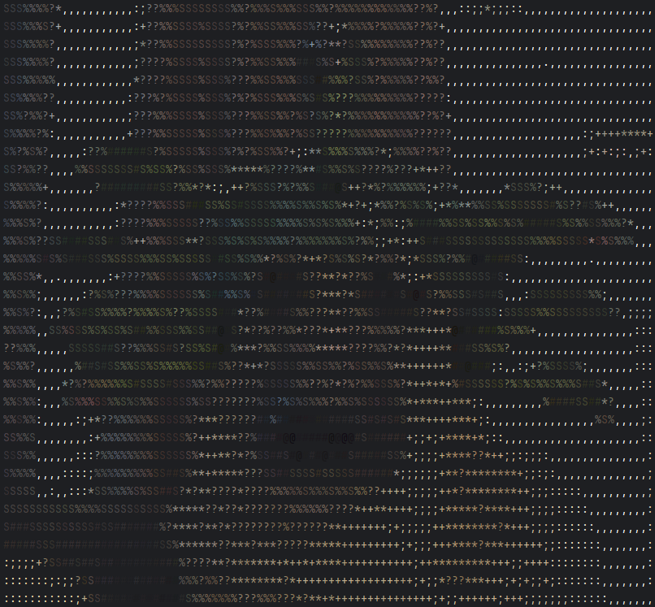
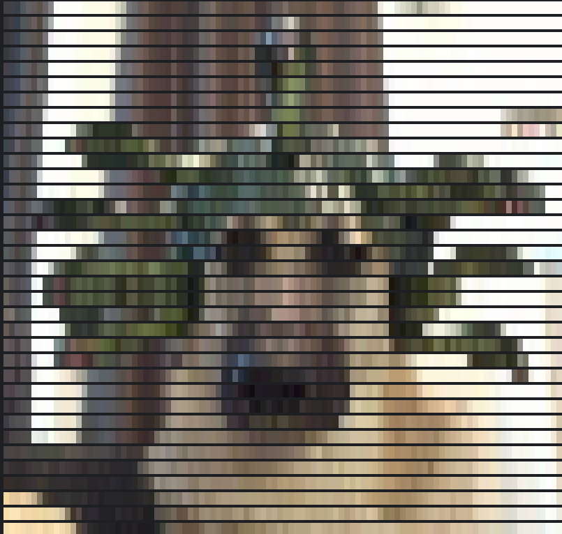

# Kek

Tool for converting images to ASCII art directly in the terminal, inspired
by [cacaview](https://linux.die.net/man/1/cacaview). Supports colored ASCII and background fills.

## Examples

### Original image examples/dog.jpg


### ASCII version

`$ kek -i example/creepy.jpg`



### With background

`$ kek -i example/dog.jpg -b`



## Requirements

- Rust

## Usage

To get acquainted with the functionality, you can use:

```bash
cargo run -- -h
```

```text
Usage: kek [OPTIONS] --input <INPUT>

Options:
  -i, --input <INPUT>    Path to image
  -o, --output <OUTPUT>  Path to output file [default: output.txt]
  -w, --width <WIDTH>    Image width in characters [default: 100]
  -s, --should-display   Should output be displayed
  -b, --background       Fill background
  -h, --help             Print help
  -V, --version          Print version
```

## Installation

To install `kek`, run:

```bash
./bin/install.sh 
```

You can see something like this:

```text
Building the application...
   Compiling kek v0.1.0 (/path/to/project/folder)
    Finished `release` profile [optimized] target(s) in 4.46s
Installing the application...
[sudo] password for master: 
kek has been installed successfully.
``` 

## Uninstallation

To remove `kek`, run:

```bash
./bin/uninstall.sh 
```

```text
Uninstalling the application...
kek has been uninstalled successfully.
```
